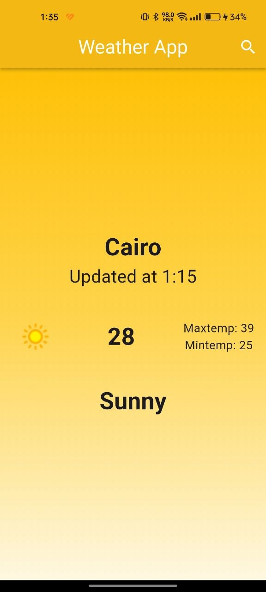
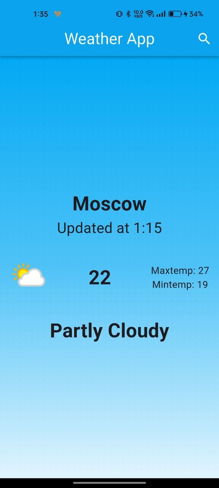

# Weather App

A clean, single-purpose Flutter app for checking the current weather and daily forecast in any city, powered by the WeatherAPI.com API.

## Screenshots

| Main View | Search View |
|---|---|
|  |  |

| Sunny Weather | Cloudy Weather |
|---|---|
|  |  |

## Features

- **Search any city** by name from a dedicated search screen
- **Current conditions** — live temperature, weather condition, and today's high/low
- **Themed UI** — background gradient adapts to the current weather condition
- **Predictable state handling** via Cubit: initial, loaded, and failure states are handled explicitly, with a dedicated empty-state view before a search is made
- **Graceful error handling** — failed lookups (e.g. invalid city) surface a clear error state instead of crashing

## Tech Stack

- **Flutter** — cross-platform UI toolkit
- **flutter_bloc** — state management with Cubit
- **dio** — HTTP client for the WeatherAPI.com integration
- **WeatherAPI.com** — weather data source

## Project Structure

```
lib/
├── cubits/
│   └── get_weather_cubit/    # GetWeatherCubit + WeatherState (initial/loaded/failure)
├── models/                    # WeatherModel
├── services/                  # WeatherService (API calls)
├── views/                     # HomeView, SearchView
├── widgets/                   # NoWeatherBody, WeatherInfoBody
└── main.dart
```

## Getting Started

1. **Clone the repo**
   ```bash
   git clone https://github.com/Omar-E-Khalifa/weather_app.git
   cd weather_app
   ```

2. **Install dependencies**
   ```bash
   flutter pub get
   ```

3. **Add your own WeatherAPI.com key**
   Get a free key at [weatherapi.com](https://www.weatherapi.com/) and set it in `lib/services/weather_service.dart`.

4. **Run the app**
   ```bash
   flutter run
   ```

## Author

Built by [Omar Essam](https://github.com/Omar-E-Khalifa) as part of a self-directed Flutter learning journey.